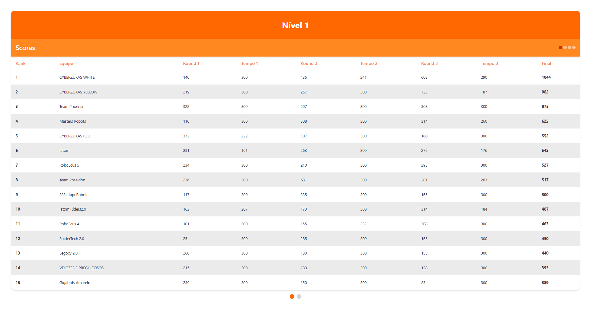
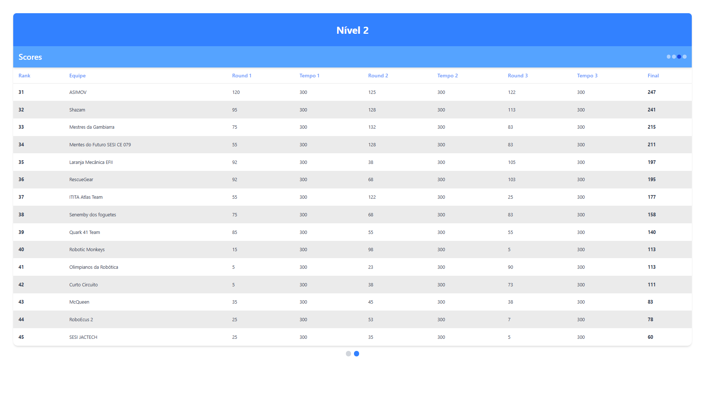

# Scoreboard

 

### Primeira Versão

  
   

### Segunda Versão

  
   

  
   

 
 

> Descrição do Projeto

Este projeto foi desenvolvido com o objetivo de apoiar os treinos de robótica, proporcionando aos estudantes uma ferramenta para monitorar e comparar seus desempenhos ao longo de diferentes rounds.

A aplicação exibe uma tabela dinâmica que apresenta as pontuações e os tempos obtidos em cada uma das três rodadas. Além disso, o sistema gera automaticamente um ranking, organizando os participantes conforme a maior pontuação alcançada.

Os dados ilustrados na imagem acima foram extraídos do site oficial da Olimpíada Brasileira de Robótica [OBR](https://obr.robocup.org.br/sao-paulo/), referentes à edição de 2024, e foram utilizados exclusivamente para exemplificar e auxiliar no desenvolvimento do layout do sistema.

## 🚀 Tecnologias

Esse projeto foi desenvolvido com as seguintes tecnologias:

#### Fronend

- ReactJS
- React-dom
- React-router-dom
- Tailwindcss/vite
- Tailwind-merge
- Prop-types
- Heroicons/react

#### Backend

- NodeJS
- Express
- Cors

## ✉️ [Contato](https://hugolino.com.br)

hugolino2609@gmail.com
