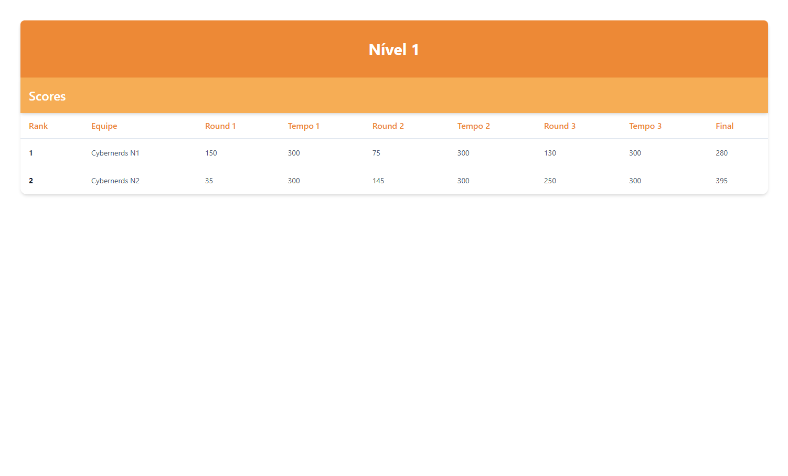

# Scoreboard

 

  
   

 
 

> Descrição

Este projeto foi desenvolvido para auxiliar nos treinos de robótica, permitindo que os estudantes comparem seus desempenhos entre os rounds. Os dados são apresentados em uma tabela que exibe as pontuações e os tempos de cada uma das três rodadas. Além disso, a tabela gera um ranking automaticamente, ordenando os participantes de acordo com a maior pontuação.

## 🚀 Tecnologias

Esse projeto foi desenvolvido com as seguintes tecnologias:

#### Fronend
- ReactJS
- React-router-dom
- Tailwindcss

#### Backend
- NodeJS
- Express
- Cors

## ✉️ [Contato](https://hugolino.com.br)

hugolino2609@gmail.com
